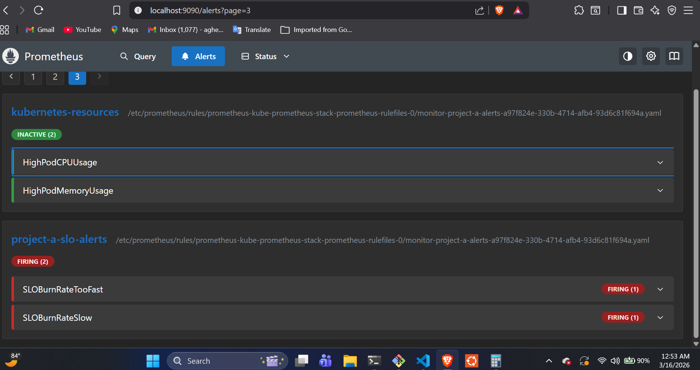

# Kubernetes Observability Stack (Prometheus + Alertmanager + Slack)

This project provides a **production-ready monitoring and alerting setup** for Kubernetes workloads using:

* **Prometheus Operator**
* **PrometheusRule**
* **AlertmanagerConfig**
* **Slack alert notifications**

The system monitors application and automatically sends alerts to a Slack channel.
- NOTE: **ServiceMonitor** for service discovery is defined in application helm charts
---

# Architecture

The alert pipeline works as follows:
```
Application Metrics
↓
Prometheus Scrapes Metrics
↓
PrometheusRule Evaluates Alert Conditions
↓
Alertmanager Receives Alerts
↓
AlertmanagerConfig Routes Alerts
↓
Slack Notifications
```
---
# Diagram
### When alert is firing


### When alert stops firing


## prometheusRule

# Components

## PrometheusRule

Defines alert rules based on PromQL expressions.

Examples of alerts included:

* High Pod CPU Usage
* High Pod Memory Usage
* Pod CrashLoop Detection
* SLO Error Budget Burn Rate

Example:

```yaml
- alert: HighPodCPUUsage
  expr: |
    sum(rate(container_cpu_usage_seconds_total{namespace="prod"}[5m])) by (pod, namespace)
    /
    sum(kube_pod_container_resource_limits{resource="cpu"}) by (pod, namespace)
    > 0.7
  for: 5m
  labels:
    severity: warning
  annotations:
    summary: "High CPU usage on pod"
    description: "Pod {{ $labels.pod }} in namespace {{ $labels.namespace }} is using more than 70% CPU"
```

---

## AlertmanagerConfig

Routes alerts to Slack and formats the message content.

Key features:

* Alert grouping
* Slack notifications
* Alert inhibition
* Custom alert message formatting

Example configuration:

```yaml
apiVersion: monitoring.coreos.com/v1alpha1
kind: AlertmanagerConfig
spec:
  route:
    groupBy: ["alertname", "namespace"]
    receiver: slack-team

  receivers:
    - name: slack-team
      slackConfigs:
        - apiURL:
            name: slack-webhook
            key: webhook
          channel: "#alerts"
          sendResolved: true
```

---

# Slack Webhook Secret

Slack webhook URLs should **never be stored in Git**.
They must be stored as a Kubernetes Secret.

Create the secret:

```bash
kubectl create secret generic slack-webhook \
  --from-literal=webhook="https://hooks.slack.com/services/XXX/XXX/XXX" \
  -n monitoring
```

---

# Slack Alert Message Format

Alerts sent to Slack include the information defined in the Prometheus rule annotations.

Example Slack message:

```
Alert: HighPodCPUUsage
Severity: warning

Summary: High CPU usage on pod
Description: Pod backend-abc123 in namespace prod is using more than 70% CPU
```

---

# Alert Inhibition

To reduce alert noise, warning alerts are suppressed when a critical alert for the same issue exists.

Example:

```yaml
inhibitRules:
- sourceMatchers:
  - severity="critical"
  targetMatchers:
  - severity="warning"
  equal:
  - alertname
  - namespace
```

---

# Deployment

Install the observability stack:

```bash
helm install  observability ./observability \
-n monitoring
```

Verify resources:

```bash
kubectl get prometheusrules -n monitoring
kubectl get alertmanagerconfig -n monitoring
```

---

# Testing Alerts

To confirm Slack integration works, trigger an alert by generating load on a pod or adjusting alert thresholds temporarily.

You can also check firing alerts in Prometheus:

Prometheus UI → Alerts → Firing

---

# Best Practices

* Stored webhook URLs in **Kubernetes Secrets**
* Use **Alertmanager grouping** to reduce alert noise
* Implement **alert inhibition** for severity levels
* Include **clear summaries and descriptions** in alerts
* Monitor both **application metrics and cluster metrics**

---

## Author

Project-A Kubernetes Observability Stack
